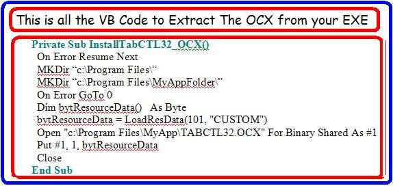



## VB Resource for OCX embedded in EXE

### Description

My SETUP OCX IN SPLASH SCREEN uses an array of data. That was fine, but if you want to use the snazzy, built-in VB Resource Editor to include your OCX files, then this wee tutorial when combined with the application I uploaded today may make life really easy for you with your ZIP uploads to your favourite download URL!
 
### More Info
 

             |
---                |---
**Submitted On**   |2006-04-16 23:47:38
**By**             |[Kevin Ritch](https://github.com/Planet-Source-Code/PSCIndex/blob/master/ByAuthor/kevin-ritch.md)
**Level**          |Advanced
**User Rating**    |4.5 (18 globes from 4 users)
**Compatibility**  |VB 6\.0
**Category**       |[Coding Standards](https://github.com/Planet-Source-Code/PSCIndex/blob/master/ByCategory/coding-standards__1-43.md)
**World**          |[Visual Basic](https://github.com/Planet-Source-Code/PSCIndex/blob/master/ByWorld/visual-basic.md)
**Archive File**   |[VB\_Resourc1987664172006\.zip](https://github.com/Planet-Source-Code/kevin-ritch-vb-resource-for-ocx-embedded-in-exe__1-65029/archive/master.zip)

### Source Code

http://V8Software.com/VBResourceFeature.doc

